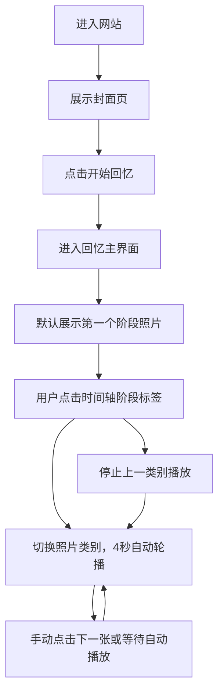

## 1. 产品概述

一个浪漫的恋爱回忆展示网站，以"珍珍爱上了阿翔"为主题，通过时间轴形式展示两人从初识到结婚的甜蜜回忆照片。用户点击时间轴上的阶段名称，即可在大屏幕上轮播该阶段的照片。

## 2. 核心功能

### 2.1 功能模块
1. **首页封面**：展示标题"珍珍爱上了阿翔"，配有浪漫背景和"开始回忆"按钮
2. **回忆时间轴**：按文件夹顺序展示9个恋爱阶段，每个阶段配有阶段名称标签
3. **照片放映屏**：大屏幕区域展示当前选中阶段的照片轮播，配合手写体文字描述
4. **音乐播放器**：极简UI，支持播放/暂停、进度条，进度条标注5:20和13:14浪漫时刻
5. **动态背景**：重复的白色手写体"珍珍爱阿翔❤️"背景装饰，粉色爱心鼠标

### 2.2 页面详情
| 页面名称 | 模块名称 | 功能描述 |
|---------|---------|---------|
| 主页 | 封面区域 | 居中标题、浪漫背景、开始回忆按钮 |
| 主页 | 照片放映屏 | 大图展示区域，自动轮播或手动切换，4秒一张 |
| 主页 | 时间轴导航 | 9个阶段标签，点击切换照片类别，互斥显示 |
| 主页 | 音乐播放器 | 底部播放控件，播放bgm.mp3，带浪漫刻度进度条 |
| 主页 | 背景特效 | 满屏白色手写体文字，粉色爱心鼠标拖尾 |

## 3. 核心流程

## 4. 用户界面设计

### 4.1 设计风格
- **配色**：温柔奶油粉径向渐变（#fce4ec → #f8bbd0 → #f48fb1），低饱和度柔雾粉白
- **质感**：油画纸张肌理 + 磨砂柔雾纹理（CSS噪点叠加）
- **字体**：中文使用手写体风格字体，标题用衬线体
- **布局**：全屏布局，居中白色柔光爱心，极简扁平化
- **动效**：丰富过渡动画、鼠标爱心拖尾、照片切换淡入淡出

### 4.2 页面设计概述
| 页面名称 | 模块名称 | UI元素 |
|---------|---------|--------|
| 主页 | 封面 | 全屏径向渐变背景，居中大标题，发光爱心，开始按钮 |
| 主页 | 放映屏 | 大图轮播区，照片带圆角阴影，下方手写体文字 |
| 主页 | 时间轴 | 横向排列的阶段标签，当前选中高亮 |
| 主页 | 播放器 | 底部固定，简约图标，爱心进度节点 |