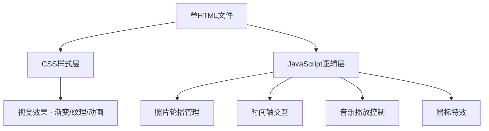

## 1. 架构设计



## 2. 技术说明
- **前端**：纯HTML + CSS + JavaScript，单文件实现
- **运行方式**：直接在浏览器打开HTML文件
- **资源**：本地图片文件夹和bgm.mp3
- **无需任何构建工具或外部依赖**

## 3. 数据结构

```javascript
// 回忆阶段数据
const memories = [
  { id: "1初识", name: "初识", images: ["...jpg", "...png"], descriptions: ["文字1", "文字2"] },
  { id: "2表白", name: "表白", images: [...], descriptions: [...] },
  // ... 9个阶段
]
```

## 4. 核心逻辑
- **照片轮播**：setInterval 4秒切换，支持手动点击上一张/下一张
- **阶段切换**：点击时间轴标签，清除上一轮播定时器，启动新轮播
- **音频播放**：HTML5 Audio API，播放/暂停控制
- **鼠标特效**：Canvas绘制爱心粒子跟随鼠标，带拖尾消散效果